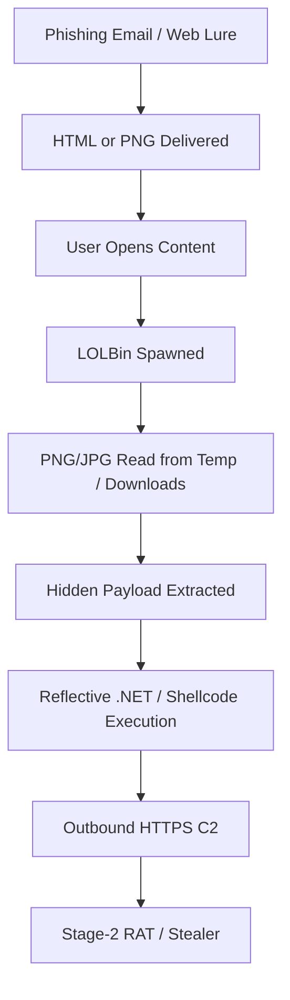

# Stego-Based Loader Attack Chain (2024–2025)
### Behavioural Threat Hunting SOP • Patch-Resistant Initial Access • Memory-First Tradecraft

**Author:** Ala Dabat  
**Version:** 2025-12  
**Audience:** L2 / L3 Threat Hunters, Detection Engineers  
**Repository Context:** Advanced Threat Hunting Rules – Steganography Attacks  

---

## 🔗 Detection Logic (Referenced – NOT Embedded)

This SOP documents the **entire steganographic loader attack chain** and is operationally aligned to the following detection rules:

1. **Image-Based Stego Loader Chain (Expanded PID Coverage)** https://github.com/azdabat/Advanced-Threat-Hunting-Rules/blob/main/Steganography%20Attacks/Image-Based%20Stego%20Loader%20Chain.kql  

2. **Stego Image Loader — Phase 2 (.NET Reflective / In-Memory Execution)** https://github.com/azdabat/Advanced-Threat-Hunting-Rules/blob/main/Steganography%20Attacks/Stego%20.NET%20In-Memory%20Hunt.kql  

---

## 1. Executive Summary

Steganographic malware loaders are among the most **evasive, patch-resistant initial access techniques** observed across 2024–2025. Attackers embed encrypted payloads inside **legitimate-looking PNG/JPG images**, delivered via phishing or web lures. Payload extraction and execution occur **entirely in memory**, commonly abusing trusted Windows LOLBins.

---

## 2. End-to-End Attack Chain (Defensive View)

---

## 3. Phase-by-Phase Threat Model & Hunting SOP

### Phase 0 — Lure & Delivery
**MITRE:** TA0001 | T1566.001 — Spearphishing Attachment

**Attacker Behaviour**
* HTML smuggling (client-side Base64 image reconstruction)
* Direct PNG/JPG attachments (often ZIP-wrapped or password-protected)
* Image delivery via phishing landing pages or compromised sites

**Hunter SOP**
* Treat HTML attachments as executable containers
* Review email telemetry for HTML + image pairings
* Pivot to browser download events and Mark-of-the-Web (Zone.Identifier)
* Identify users interacting with image-based lures shortly before execution

---

### Phase 1 — Initial Execution via LOLBins
**MITRE:** TA0002 | T1059, T1218

**Attacker Behaviour**
User-facing applications spawn script engines / LOLBins:
* `outlook.exe` → `mshta.exe`
* `winword.exe` → `powershell.exe`
* `chrome.exe` → `wscript.exe`
* `msedge.exe` → `rundll32.exe`

**Why This Is High Signal**
* These parent/child relationships are rare in benign workflows
* Indicates user-assisted execution rather than background automation

**Hunter SOP**
* Validate parent process legitimacy and user context
* Capture full process tree and command-line arguments
* Identify immediate child processes and execution depth
* Check for encoded or obfuscated script parameters

---

### Phase 2 — Steganographic Image Read
**MITRE:** TA0005 | T1027.003 — Steganography

**Attacker Behaviour**
Script/LOLBin reads PNG/JPG from:
* `%TEMP%`
* `%Downloads%`
* `AppData\Local\Temp`
* Image renders normally; payload hidden via LSB, EXIF, or appended data

**Hunter SOP**
* Correlate script execution with image file reads
* Validate read timing relative to process start
* Flag byte-wise reads of images by script engines
* Prioritise reads followed by outbound network activity

---

### Phase 3 — Payload Decode & In-Memory Execution
**MITRE:** TA0002 | T1059.001, T1059.003, T1059.005
**MITRE:** TA0005 | T1620 — Reflective Code Loading

**Attacker Behaviour**
Payload decoded from image into memory. Common indicators:
* `FromBase64String`
* `VirtualAlloc`, `WriteProcessMemory`, `CreateRemoteThread`
* `System.Reflection.Assembly::Load`
* No executable written to disk

**Hunter SOP**
* Inspect command lines for decode and reflection primitives
* Pivot to memory indicators and suspicious API usage
* Escalate if reflective loading occurs within minutes of image read
* Prepare for memory capture if active execution suspected

---

### Phase 4 — Command & Control (C2)
**MITRE:** TA0011 | T1071.001 — HTTPS

**Attacker Behaviour**
Outbound HTTPS connections from LOLBins often to:
* Newly registered domains
* CDN-lookalike infrastructure
* Cloud storage abuse endpoints
* Rapid beaconing shortly after execution

**Hunter SOP**
* Review first outbound connections from the process
* Check domain age and reputation
* Correlate network timing with image read and execution
* Block confirmed C2 domains and IPs immediately

---

### Phase 5 — Stage-2 Payload & Impact
**MITRE:** TA0006 Credential Access, TA0009 Collection, TA0008 Lateral Movement

**Attacker Behaviour**
Deployment of:
* .NET RATs
* Stealers (RedLine, Lumma, XWorm variants)
* Token and credential harvesting
* Optional persistence mechanisms introduced later

**Hunter SOP**
* Identify follow-on process creation and persistence attempts
* Check LSASS access and credential dumping indicators
* Validate no lateral movement occurred
* Expand scope to user identity and cloud telemetry

---

## 4. Behavioural Indicators (High-Fidelity)

### Parent → Child Anomalies
| Parent Process | Child Process | Rationale |
| :--- | :--- | :--- |
| `outlook.exe` | `mshta.exe` | Email client spawning script host |
| `winword.exe` | `powershell.exe` | Office macro / HTML smuggling |
| `chrome.exe` | `wscript.exe` | Browser to script engine |
| `msedge.exe` | `rundll32.exe` | Signed proxy execution |

### File Access Patterns
| Behaviour | Significance |
| :--- | :--- |
| Script reads PNG/JPG from Temp | Unusual for legitimate automation |
| Image read followed by HTTPS | Classic stego-loader chain |
| No file writes before execution | Fileless tradecraft |

---

## 5. Incident Response Workflow (Aligned to IR SOP)

* **Step 1 — Identify:** Confirm chain: user app → LOLBin → image read → network. Classify severity.
* **Step 2 — Contain:** Isolate endpoint via EDR. Block observed C2 infrastructure. Disable accounts if necessary.
* **Step 3 — Investigate:** Extract full lineage. Review mailbox/browsing history. Check for other affected hosts.
* **Step 4 — Eradicate:** Remove persistence (scheduled tasks, run keys). Reset credentials.
* **Step 5 — Recover:** Rebuild hosts if memory-only RAT confirmed. Monitor for recurrence.
* **Step 6 — Lessons Learned:** Block HTML attachments where possible. Enforce WDAC for script engines.

---

## 6. Analyst Notes
* Absence of a dropped binary does not imply benign activity.
* Focus on sequence and timing, not single events.
* Stego loaders are resilient to patching; behaviour is the primary control.

---

## 7. Summary
This SOP provides a complete, behaviourally grounded approach to detecting and responding to steganographic loader attacks. By correlating user-assisted execution, image-based payload staging, in-memory execution, and network activity, defenders can reliably surface one of the most evasive initial access techniques in modern threat campaigns.
